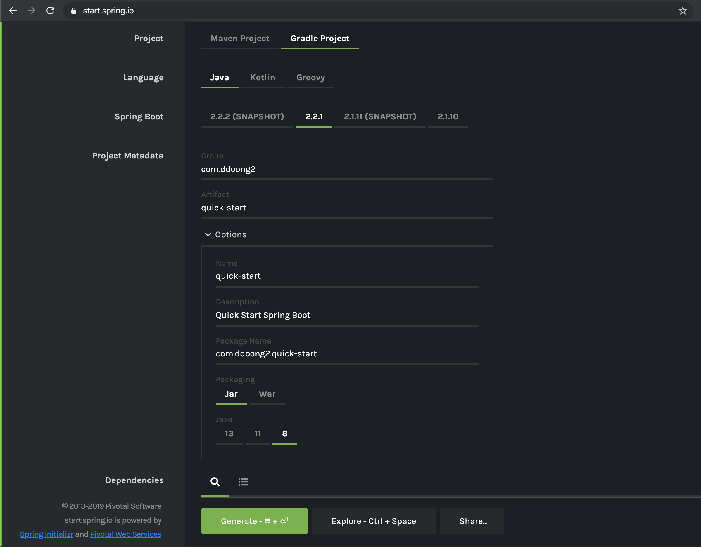
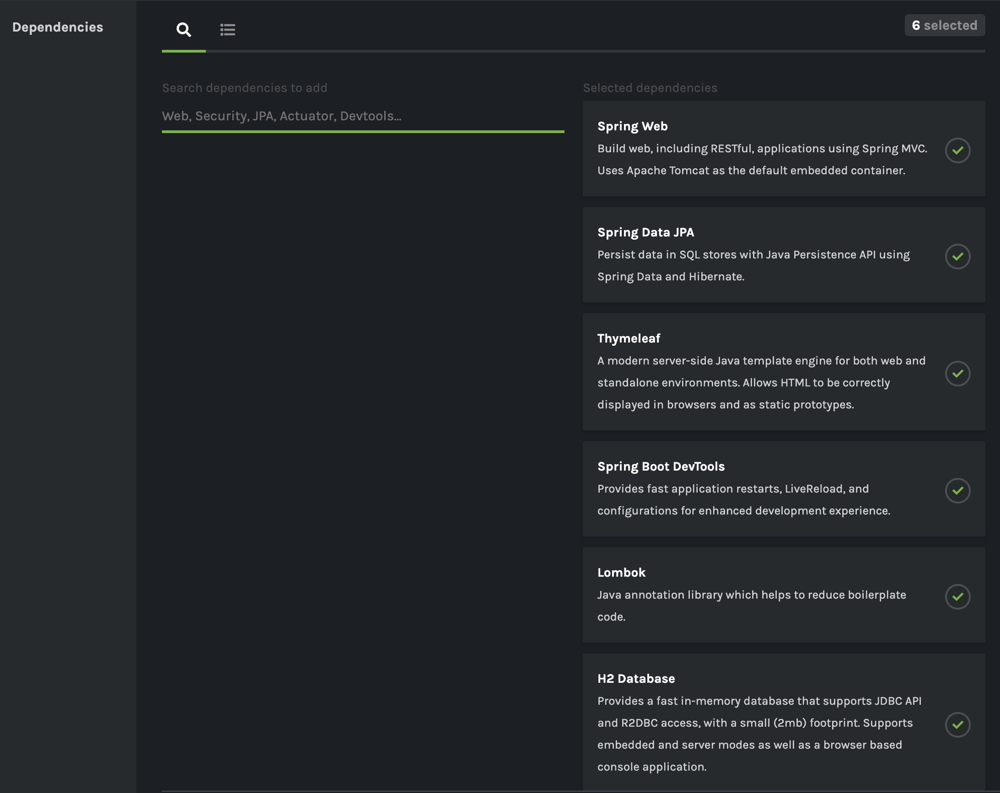
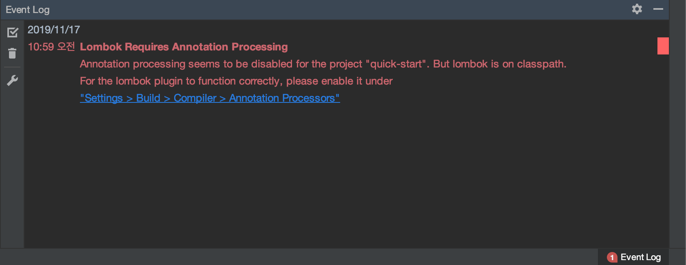
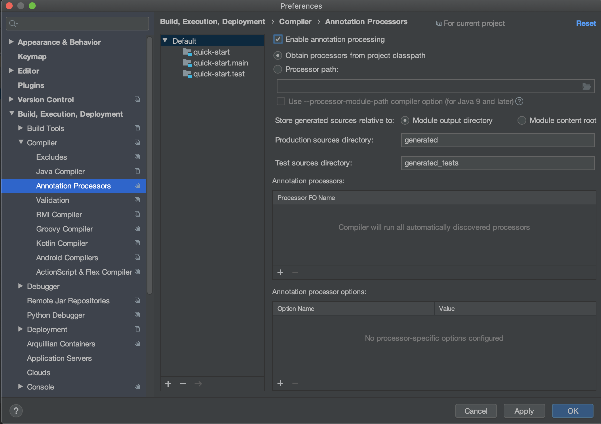
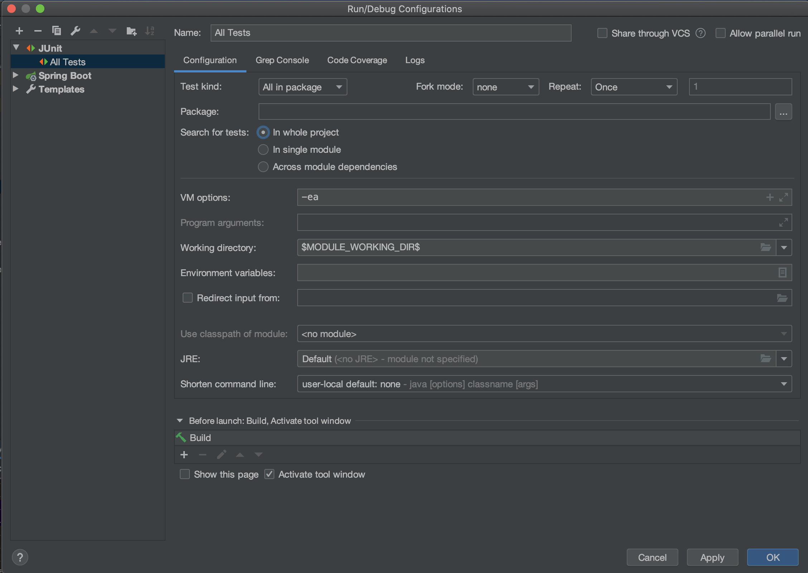
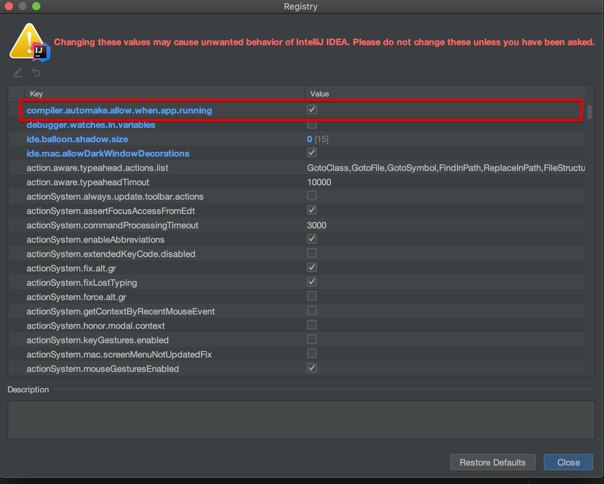
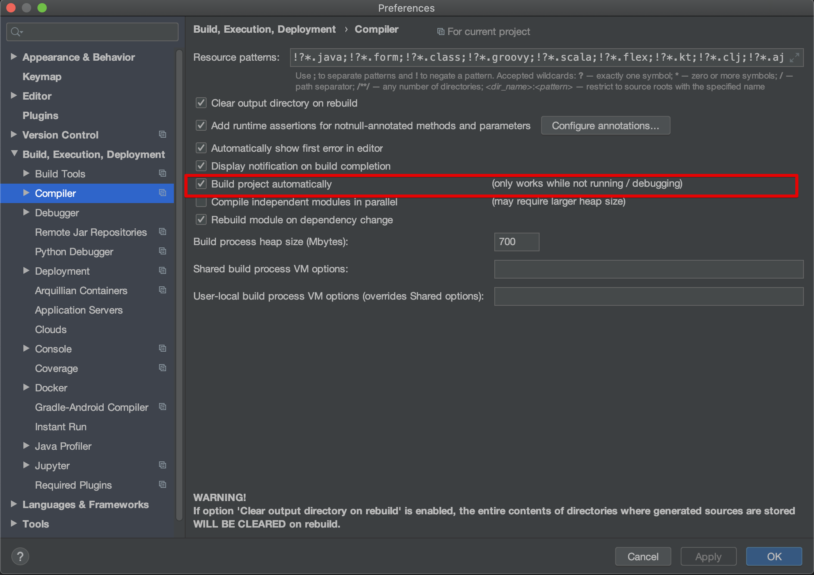
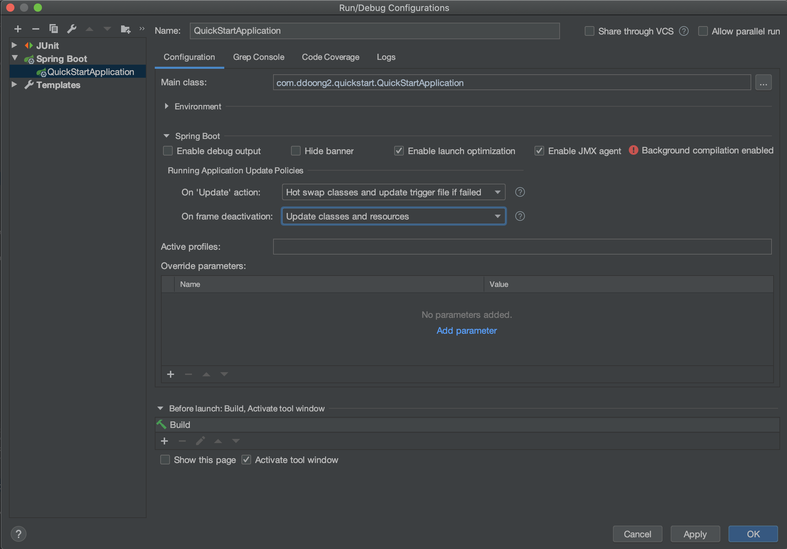
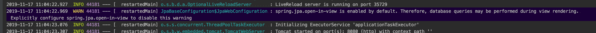

예전에 자바 프로젝트를 시작할때 우스갯 소리로 개발 셋팅 하면은 프로젝트 절반은 했다는 말을 했었다.

그만큼 개발 셋팅하는게 힘들고 오래 걸린다는 이야기인데 빌드툴(Gradle, Maven)과 Spring Boot로 인하여

예전과 같이 오래 걸리지 않는다.

아래 내용은 내가 주로 사용하는 환경(Mac, IntelliJ IDEA, Spring Boot)에서 쉽게 구성하는 방법이다.

## [Spring Boot Initializer](https://start.spring.io)


- 이미지 참조 하여 프로젝트 설정



- Web, Thymeleaf, JPA, DevTools, Lombok, H2 의존성 추가

## IntelliJ IDEA 에서 프로젝트 오픈


- 빌드하면 Annotations Processors 오류가 발생



- Preferences -> Build, Execution, Development -> Compiler -> Annotation Processors -> Enable Annotation Processing -> [선택]

## All Tests


- 기본 단위테스트 툴인 JUnit4를 사용한다.
- IntelliJ IDEA에서 전체 테스트를 검사하는 Configuration을 추가한다.

## Spring Boot DevTools
DevTools과 IntelliJ IDEA를 이용하면 HotSwap이 가능하다.



- Find Action... -> registry... -> compiler.automake.allow.when.app.running -> [선택]



- Preferences -> Build, Execution, Development -> Compiler -> Build project automatically -> [선택]

- application.properties [오픈]

```
spring.thymeleaf.cache=false
spring.devtools.livereload.enabled=true
spring.devtools.restart.enabled=false
```



- Run/Debug Configurations -> On 'Update' action -> `Hot swap classes and updte trigger file if failed` -> [선택]
- Run/Debug Configurations -> On frame deactivation -> `Update classes and resources` -> [선택]

## Run App


- Open In View를 좋아하사는 사람도 싫어하는 사람도 있는데 개인적으로 득보다 실이 많다고 생각해서 `false`로 설정하고 사용하는 편이다.

```
spring.jpa.open-in-view=false
```

## 마치며
요즘은 개발 환경 자체를 Docker를 이용해서 이미지화 해서 위에 설명한 내용 자체도 필요없을수도 있다.

다만 조직이나 팀에서 사용하는게 아닌 개인이 간단하게 프로젝트를 생성해서 아이디어를 확인할때나 프로토타입을 만들고 싶을때

쉽게 시작할수 있는 방법이라고 생각한다.


